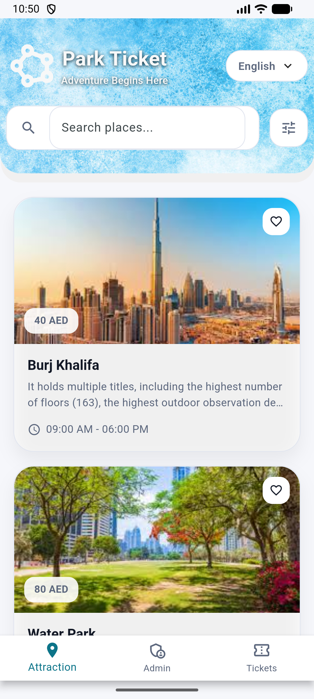
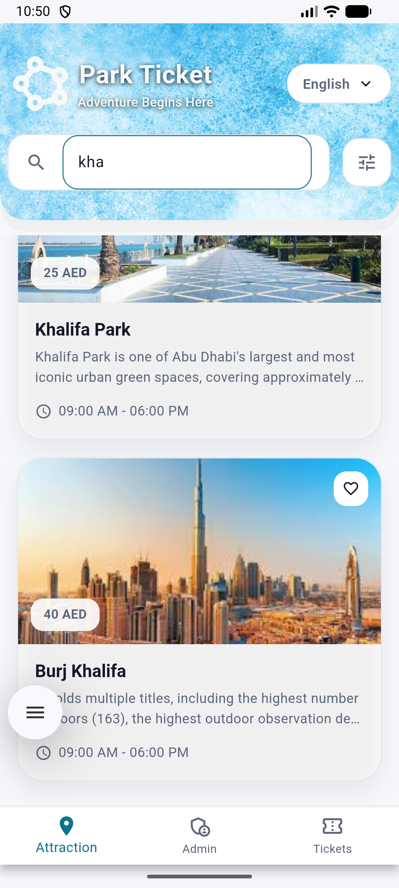
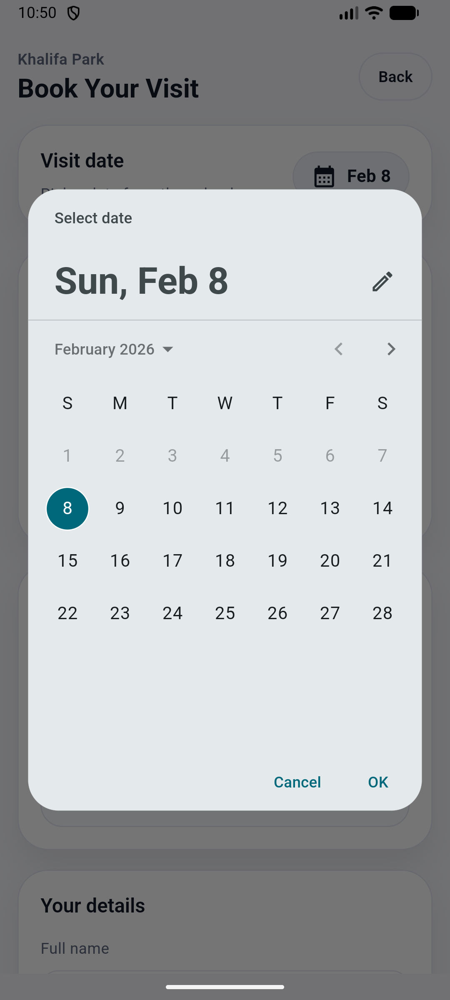
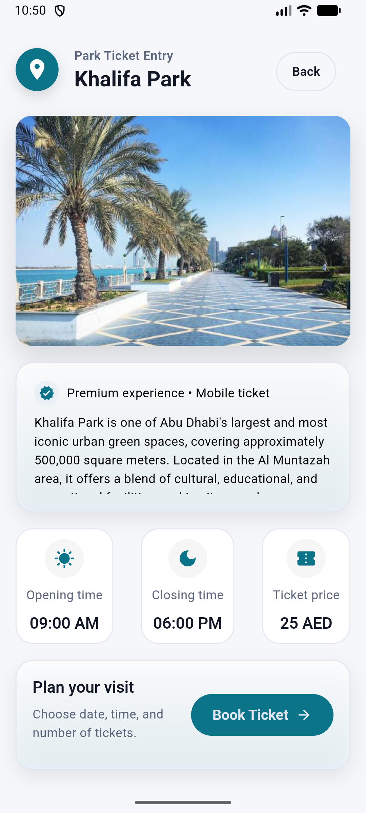
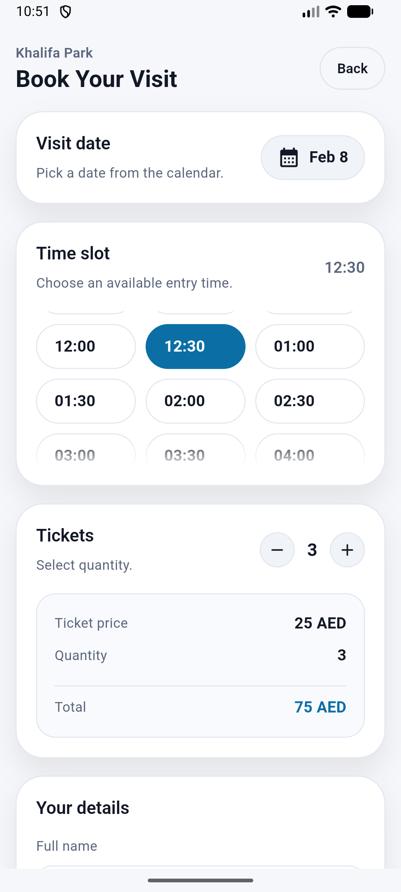
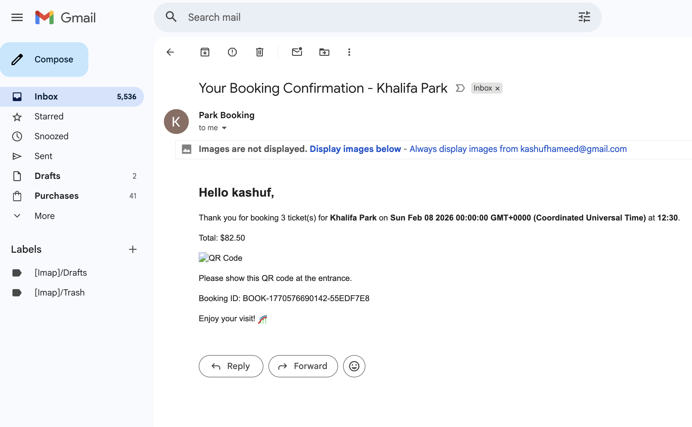

# Park Ticket

## Screenshots







## Demo Video
[Demo Video](assets/screenshots/IMG_4391.MP4)

## Run Guide 
1) Install tooling: Flutter SDK (stable), Xcode (for iOS), Android Studio + Android SDK/emulator (for Android). Add Flutter to PATH and accept Xcode licenses (`sudo xcodebuild -license`) if on macOS.
2) Clone and fetch deps:
```bash
git clone <repo-url>
cd park_ticket
flutter pub get
```
3) Provide backend URL at runtime (attach the flag to the Flutter command):
   - Localhost matrix:
     - iOS/macOS/Chrome: `http://localhost:4000`
     - Android emulator: `http://10.0.2.2:4000` (emulator loopback to host)
     - Physical Android device: your machine IP, e.g. `http://192.168.x.x:4000`
   - Examples:
```bash
flutter run --dart-define=API_BASE_URL=http://localhost:4000          # iOS sim/macOS/web
flutter run --dart-define=API_BASE_URL=http://10.0.2.2:4000          # Android emulator
flutter run --dart-define=API_BASE_URL=https://api.example.com       # hosted API
```
   - When Flutter shows “Please choose one” after listing devices, pick the target that matches the URL you passed (e.g., choose the Android emulator only if you used `10.0.2.2`).
   - iOS: ensure a simulator or device is available. From this folder you can also run `open ios/Runner.xcworkspace` for Xcode debugging.
   - Android: start an emulator or plug in a device with developer mode enabled.
4) Build app bundles (optional):
```bash
flutter build ipa   --dart-define=API_BASE_URL=https://api.example.com   # requires codemagic/Xcode signing setup
flutter build apk   --dart-define=API_BASE_URL=https://api.example.com
```
5) Troubleshooting quick hits:
   - “API_BASE_URL is not set” → rerun with the `--dart-define` flag above.
   - Connection error on Android emulator → rerun with `--dart-define=API_BASE_URL=http://10.0.2.2:4000` and ensure your backend is running/accessible.
   - Network errors on iOS/macOS → keep `http://localhost:<port>`; verify the backend process is up.
   - QR scan requires a real Android or iOS device (camera). Emulators/simulators are not supported for scanning.

An App for browsing attractions, booking tickets, and validating entries.

## Architecture Overview
- **State**: Riverpod (providers + notifiers). Async providers power API fetches; local form/search state uses `StateProvider`/`StateNotifier`.
- **Networking**: Dio wrapped by `ApiClient` (`lib/core/network/api_client.dart`) with typed error mapping and JSON normalization. Base URL is set in `api_client_provider.dart`.
- **Storage**: SharedPreferences via `LocalStorage` for user contact and admin token.
- **Navigation**: Plain Flutter `Navigator`. App shell with bottom tabs for Attractions, Admin, Tickets.
- **Styling**: AppTheme light palette; ScreenUtil for responsive sizing; SectionCard/InfoTile shared widgets for consistent surfaces.

## Feature Modules
- **Attractions** (`lib/features/attraction`)
  - **Presentation**: `AttractionListPage` lists attractions with search, favorites (local state), and pull-to-refresh. `AttractionPage` shows detail; `AttractionContent` renders hero, description, info tiles, and booking CTA.
  - **Data**: `AttractionRemoteDataSource` handles GET `/api/attractions` and `/api/attractions/:id`, defensive parsing, and graceful fallbacks. Models live in `data/models` and mirror domain entities.
  - **Domain**: Entities (`Attraction`) and use cases (`GetAttractions`, etc.) sit between presentation and data.
- **Flows**:
  - List → Detail → Book: user browses list, taps a card, views details, proceeds to booking.
  - Pull-to-refresh: swipe down on list to refetch provider.

- **Booking/Tickets** (`lib/features/booking`, `lib/features/ticket`)
  - Booking flow builds payloads and posts to `/api/bookings`; saves visitor contact locally.
  - Ticket confirmation (`ticket_confirmation_page.dart`) shows booking details and QR; amount row only.
  - Ticket history lives under Tickets tab; selecting a ticket drives confirmation view via provider snapshot.

- **Admin** (`lib/features/admin`)
  - Admin login posts to `/api/users/login`, saves JWT + user info in `LocalStorage`.
  - Gate Validation page toggles between QR scan (mobile_scanner) and “New Attraction” creation form.
  - Creation form posts multipart `/api/attractions` with image picked via `image_picker`, capacity, price, location, active flag, and logs payload/response.
  - Validation flow posts ticket QR payload to `/api/bookings/validate-qr`, shows success/error with fallbacks.
- **Admin flow summary**:
  1) Login → token stored.
  2) Validate tab: scan or create attraction (multipart with photo).
  3) Back returns to main tabs.

- **Splash** (`lib/features/splash`)
  - Animated hero background and circular “Get Started” button with rotating gradient.

## Error & Fallback Behavior
- `ApiClient` maps Dio errors to `ApiException` types: cancelled, timeout, badResponse, network, invalidResponse, unknown.
- Attractions list: falls back only on network/unknown; otherwise surfaces errors.
- Attraction detail: falls back on network/unknown; other API errors propagate.

## Refresh & Search
- Attractions list uses `RefreshIndicator` + `ref.refresh(attractionsProvider.future)`.
- Search state held in a `StateProvider`; favorites stored in a `StateNotifier` (local only).

## Image & Permissions
- Image picking for admin attraction creation via `image_picker` (gallery). Permissions set in Android manifest (READ_MEDIA_IMAGES/READ_EXTERNAL_STORAGE) and iOS Info.plist (`NSPhotoLibraryUsageDescription`).
- Camera permission already included for QR scanning (`mobile_scanner`).
- On iOS, ensure photo library permission string is customized if you rebrand; on Android 33+ `READ_MEDIA_IMAGES` is required, and `READ_EXTERNAL_STORAGE` is present for <=32.

## Local Storage
- `LocalStorage` stores user email/phone and admin JWT/name/email/role. Helper methods for save/clear/get.


## Key Files
- `lib/core/network/api_client.dart` — Dio wrapper & error mapping.
- `lib/core/network/api_client_provider.dart` — base URL provider (reads `API_BASE_URL`).
- `lib/features/attraction/presentation/pages/attraction_list_page.dart` — list/search/refresh UI.
- `lib/features/attraction/presentation/pages/attraction_page.dart` — detail page.
- `lib/features/admin/presentation/pages/gate_validation_page.dart` — admin hub (QR validation + attraction creation).
- `lib/features/admin/presentation/pages/admin_login_page.dart` — admin auth.
- `lib/features/ticket/presentation/pages/ticket_confirmation_page.dart` — ticket details/QR.
